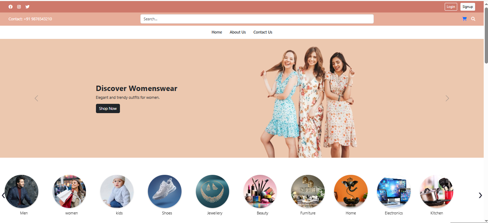
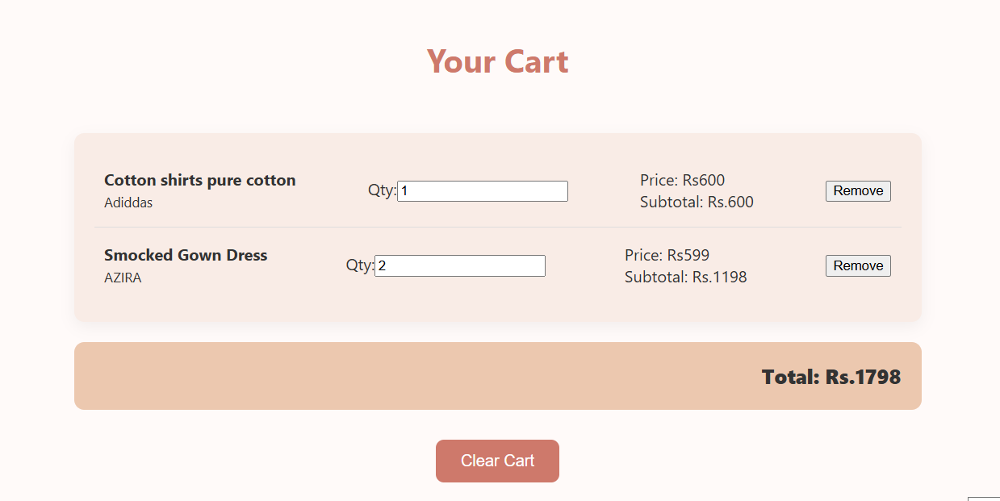

# 🛍️ ShopZone – E-Commerce Website

**ShopZone** is a responsive eCommerce website built using HTML, CSS, JavaScript, and Bootstrap. It features a clean UI, smooth navigation, product browsing by category, shopping cart functionality, and user authentication (login/signup).

---

## ✨ Features

- 🛒 Product categories: Men, Women, Kids, Electronics, Beauty, Home, Furniture
- 🧾 Shopping cart with price, subtotal, and total calculation
- 🔍 Search bar and category navigation
- 🧑‍💼 Login and Signup system using localStorage
- 🎠 Carousel showcasing featured categories
- 📱 Responsive design for mobile and desktop
- 💡 Offers and featured products section
- 📰 Newsletter subscription form in footer

## 🛠️ Technologies Used

- HTML5
- CSS3
- JavaScript
- Bootstrap 5
- Font Awesome

## 📸 Screenshots

### 🏠 Homepage

### 🛒 Cart Page

### 🛍️ Product Page

  
  

## 🙋‍♀️ Note from the Developer

This project was built as part of my frontend development learning journey and showcases my skills in HTML, CSS, JavaScript, and Bootstrap.  
I enjoyed designing a user-friendly shopping experience and plan to keep improving it.

I'm open to feedback, collaborations, and opportunities in web development.  
If you'd like to connect, feel free to reach out on [LinkedIn](www.linkedin.com/in/ksrilatha
) or check my [GitHub](https://github.com/KSriLatha18).

---

## 🙏 Thank You

Thank you for visiting this repository!  
If you found it useful or interesting, please give it a ⭐ star and share your thoughts.

Happy Coding! 💻

